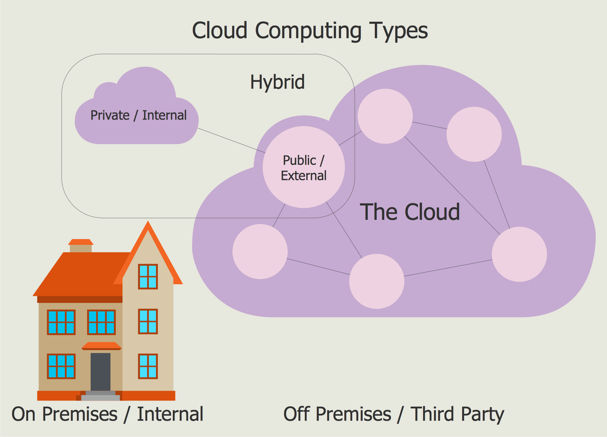

 # Cloud_computing

## Public Cloud 

• A service provider makes resources, such as virtual machines (VMs), applications or storage, available to the general public over the Internet 

• Public cloud services may be free or offered on a pay-per-usage model 

• The main difference between public and private clouds is that the individual or organization is not responsible for any of the management of a public cloud hosting solution 

• The data is stored in the provider's data center and the provider is responsible for the management and maintenance of the data center

# Private Cloud 

• A private cloud is a cloud computing model that involves a secure cloud based environment where only the specified organization can access its resources 

• Data center may be wholly in-house on the company’s premises, or provided by a third party 

• Private cloud services can vary considerably from a technical aspect, therefore it is usually categorized by the features that they offer to their client

# Hybrid 

• Hybrid cloud is a cloud computing environment which uses a mix of on-premises, private cloud, and third-party, public cloud services with adaptation between the two platforms 

• By allowing loads to move between private and public clouds as computing needs change, the hybrid cloud gives organizations greater flexibility and data deployment options

# Relationship between Local and Cloud Resources 

• The traditional IT model advantages and disadvantages 
  
  - Advantages: Very secure/full control of applications and data 
  
  - Disadvantages: Own Hardware/upgrades, software/upgrades, power/issues, redundancy and business continuity, large in-house IT department 

• Cloud computing model advantages and disadvantages 

  - Advantages: Flexibility and scalability with hardware, software, power issues, redundancy and business continuity are handled by vendor, and smaller IT department 
  
  - Disadvantages: Security might be a primary concern, expertise with application needs

## AWS

AWS stands for Amazon Web Services to contrast their shipping services. It is a collection of services that Amazon provides online. These are things like storage, backup, DNS, database, load balancing and maybe the most popular, virtual machine hosting. The concept about all this is the economy of scale. Amazon will build huge data centers and engineer them to provide the kind of services that most businesses need. Since they do it on a huge scale they are able to do it cheaper then if every business were to build their own from scratch. There are however lots of disadvantages like needing a lot more spare capacity and having to build something that fits everyone as opposed to something that fits a particular user. So it depends on the use case if you save money by using their services as opposed to making your own from scratch.

One of the most revolutionary benefits that AWS brought into the market is that purchasing additional capacity is much easier and faster. You might have taken weeks to buy hardware and install it at your location. Or if you are renting though traditional suppliers you might take a few hours to let them manually reconfigure things. However AWS made everything automatic so you can get a new server within seconds. This have allowed businesses to build their applications to allow them to scale on demand. This means that they pay different amount of money for the services depending on how much they use. This have the ability to reduce costs but it again require more time to develop and maintain the more complex applications.

#  Cloud Connectivity Methods 

• Web portal – customer accesses the cloud through a website 

• VPN – customer makes a VPN connection over the Internet to the cloud system 
  
  - Public cloud services may offer VPN appliances or native VPN through the network services control • Direct connection - A more predictable connection might be direct private connection via co-location facilities 
  
  - Referred to as cloud hotels, cloud providers partner with large data center providers 
 
  - Direct connections come in two Ethernet speeds of 1Gbps or 10Gbps 
 
• Telco managed – Individuals or organizations have a wider variety of connectivity with Telco providers 
 
  - Telco providers offer MPLS and Ethernet connection options and a variety of contract lengths

# Security Implications/ Considerations

Cloud Security Implications/Considerations 

• You are not in control of your data 

• The provider must have good controls and assurances in place 

• You will need to implement compensating controls to cover any gaps discovered in the provider’s security e.g. encryption or local copy of the data

• You will be responsible for the security of any aspect of the cloud that you are permitted to configure e.g. health record

# IaaS Security Implications/Considerations 

• Similar to the concerns of a traditional corporate data center 

• You the customer will be responsible for all aspects of security at all levels of your network + firewalls

  - Provider is responsible for security of physical equipment and personnel that maintains the physical equipment 

• You the customer are responsible for ensuring compliance standards are evaluated and met 

• An auditor will need to be able to determine if compliance requirements are met

# PaaS Security Implications/Considerations 

• The provider is responsible for physical equipment and platform/system availability 

• You the customer are responsible for: 
  
  - Any applications you have configured on that platform 
  
  - Monitoring access and usage 
  
  - Keeping track of regulatory compliance 

• One of the features you will have to decide on is whether or not you will include (and pay for) redundancy

# SaaS Security Implications/Considerations 

• The provider is responsible for most of the security 

• You the customer are focused on application configuration and data protection 

• You are also likely to be concerned with maintaining: 
  
  - Identity and Access Management (IAM) controls (e.g., single sign-on and federation) 
  
  - Data protection technology (e.g., data loss prevention and encryption) 

• You might choose to integrate your on-premises deployment with the SaaS deployment

